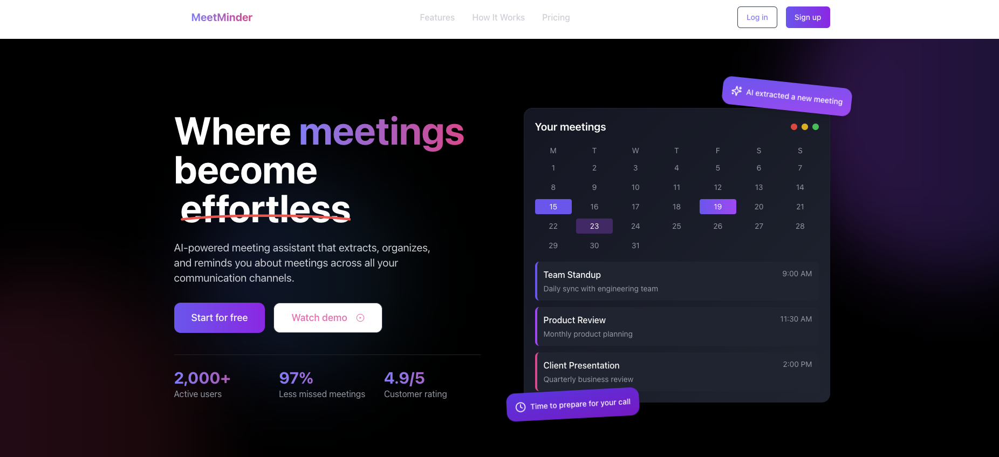
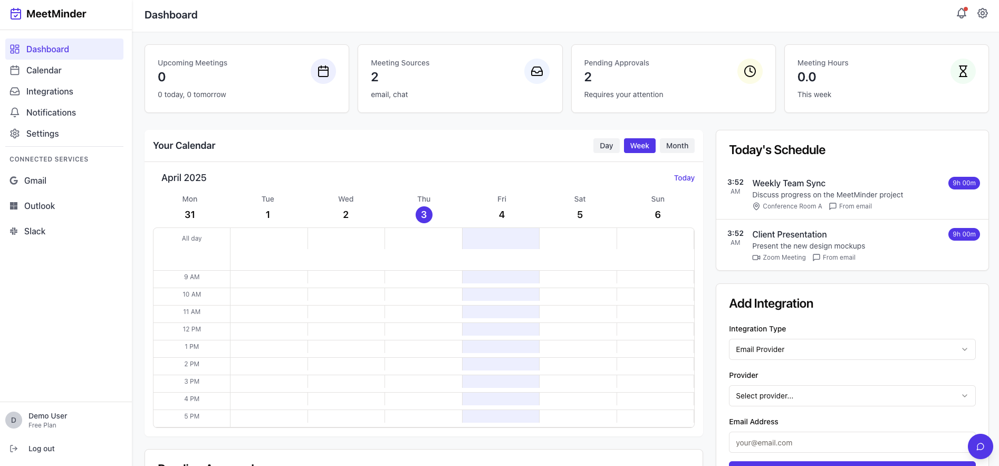

# MeetMinder: AI-Powered Meeting Management

MeetMinder is a sophisticated web application that extracts meeting information from emails and chat platforms, integrating them into a unified calendar with AI-powered notifications.


# Seamless AI Integration


## Features

- **Smart Meeting Extraction**: AI automatically identifies meeting details from emails and chat messages
- **Unified Calendar**: View all your meetings in a single, clean interface
- **Meeting Approval System**: Review and approve meeting suggestions before they're added to your calendar
- **AI Assistant**: Get help managing your meetings with our built-in chat assistant
- **Multi-platform Integration**: Connect with Gmail, Outlook, Slack, Microsoft Teams, and more
- **Smart Notifications**: Never miss a meeting with customizable reminders

## Tech Stack

- **Frontend**: React, TypeScript, TailwindCSS, Shadcn UI
- **Backend**: Node.js, Express
- **Database**: PostgreSQL with Drizzle ORM
- **Authentication**: Passport.js
- **AI Integration**: OpenAI (for natural language processing)

## Demo

https://github.com/user-attachments/assets/1fbf7f25-5439-413e-b693-9daff5083292

A live demo of the application is available at: [https://meetminder.vercel.app](https://meetminder.vercel.app)

For the demo, the authentication has been bypassed so you can access the dashboard directly without needing credentials.

## Getting Started

### Prerequisites

- Node.js 18 or higher
- npm or yarn

### Installation

1. Clone the repository:
   ```bash
   git clone https://github.com/yourusername/meetminder.git
   cd meetminder
   ```

2. Install dependencies:
   ```bash
   npm install
   ```

3. Set up environment variables:
   Create a `.env` file at the root of the project with the following variables:
   ```
   SESSION_SECRET=your_session_secret
   
   # Optional: For OpenAI features (not required for demo)
   OPENAI_API_KEY=your_openai_api_key
   ```

4. Start the development server:
   ```bash
   npm run dev
   ```

5. Open your browser and navigate to:
   ```
   http://localhost:5000
   ```

### Build for Production

To build the application for production:

```bash
npm run build
```

To start the production server:

```bash
npm start
```

## Deployment

This project is configured for easy deployment on Vercel:

1. Push your code to a GitHub repository
2. Connect the repository to your Vercel account
3. Configure the environment variables
4. Deploy

## Project Structure

```
.
├── client/                   # Frontend code
│   ├── src/
│   │   ├── components/       # UI components
│   │   ├── hooks/            # Custom React hooks
│   │   ├── lib/              # Utility functions
│   │   ├── pages/            # Page components
│   │   └── ...
├── server/                   # Backend code
│   ├── auth.ts               # Authentication logic
│   ├── routes.ts             # API routes
│   ├── storage.ts            # Data storage interface
│   └── ...
├── shared/                   # Shared code between frontend and backend
│   └── schema.ts             # Database schema and types
└── ...
```

## How It Works

1. **Account Connection**: Users connect their email and chat platform accounts
2. **Meeting Extraction**: AI processes incoming messages to identify meeting requests
3. **Meeting Management**: Users review, approve, or decline proposed meetings
4. **Calendar Integration**: Approved meetings appear in the unified calendar
5. **Smart Notifications**: Users receive timely reminders before meetings

## Customization

### Themes

The application supports theme customization through the `theme.json` file.

### Adding New Integrations

To add new email or chat platform integrations, extend the SourceProvider type in `shared/schema.ts` and implement the corresponding connectors.

## License

[MIT](LICENSE)
